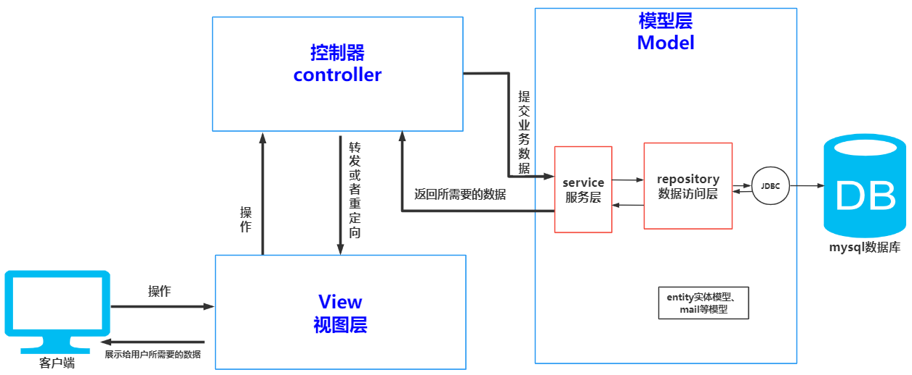

# 设计模式
### 1 MVC三层架构
> + 在MVC的组成之中会包含以下几点：
>   + 模型层：完成可重用类设计，例如，实体类的设计；
>   + 视图层：JSP、HTML、CSS、JavaScript显示出不牵扯到过多的Java程序，最好的显示出是没有任何的Java程序；
>   + 控制层：Servlet（接收数据、验证数据、调用业务、跳转页面） 控制层不负责数据的显示出来，只是负责将数据处理后交给JSP显示。

> + MVC三层架构的具体说明
>   + **模型层（Model）:**
    模型表示企业数据和业务规则。在MVC的三个部件中，模型拥有最多的处理任务。例如它可能用像EJBs和ColdFusion Components这样的构件对象来处理数据库，被模型返回的数据是中立的，就是说模型与数据格式无关，这样一个模型能为多个视图提供数据，由于应用于模型的代码只需写一次就可以被多个视图重用，所以减少了代码的重复性。
    模型层更多是Java编写的，它接受视图层请求的数据，然后进行相应的业务处理，并返回最终的处理结果。模型层担负的责任最为核心，并使得应用程序得到重用和可扩展。
>   + **视图层（View）:**
    视图是用户看到并与之交互的界面。对老式的Web应用程序来说，视图就是由HTML元素组成的界面，在新式的Web应用程序中，HTML依旧在视图中扮演着重要的角色，但一些新的技术已层出不穷，它们包括Adobe Flash和像XHTML，XML/XSL,WML等一些标识语言和Web services.
    简单地说，用户交互界面，在Web应用中，可以是JSP、HTML、CSS、JavaScrip程序。使用MVC模式设计的视图层仅仅进行数据的采集和处理，以及用户的请求，而业务流程的控制和处理则是交给控制层（Controller）和模型层（Model）。
>   + **控制层（Controller）:**
    控制器接受用户的输入并调用模型和视图去完成用户的需求，所以当单击Web页面中的超链接和发送HTML表单时，控制器本身不输出任何东西和做任何处理。它只是接收请求并决定调用哪个模型构件去处理请求，然后再确定用哪个视图来显示返回的数据。
    从用户端接收请求，将模型和视图匹配在一起，共同完成用户地请求。它的作用就是告诉容器应该选择什么样的视图以及选择什么样的模型。例如，当一个用户点击一个链接时，控制层接受到请求之后，并不直接进行任何的数据操作，而是把用户的请求信息传递给相应的模型层，并告诉模型应该进行什么样的操作，最后根据操作结果选择符合要求的视图返回给请求用户。
控制器在MVC设计模式中就是一个中间枢纽的作用，协调着视图和模型层的操作。

### 2 MVC视图分析

