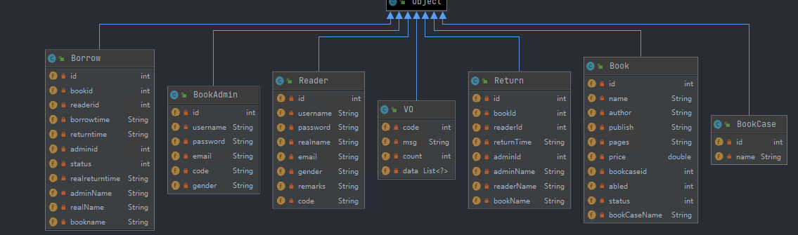
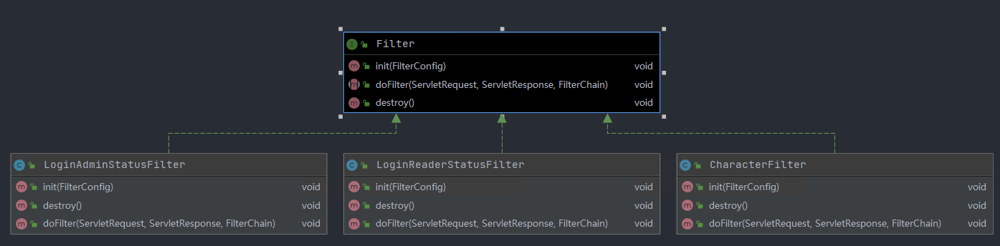
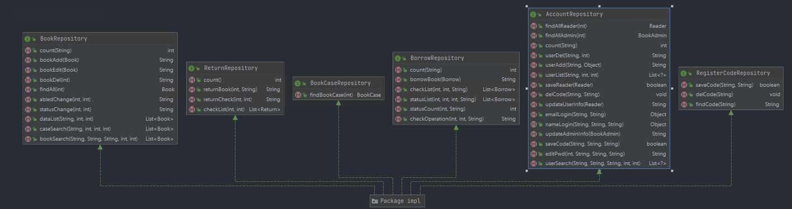
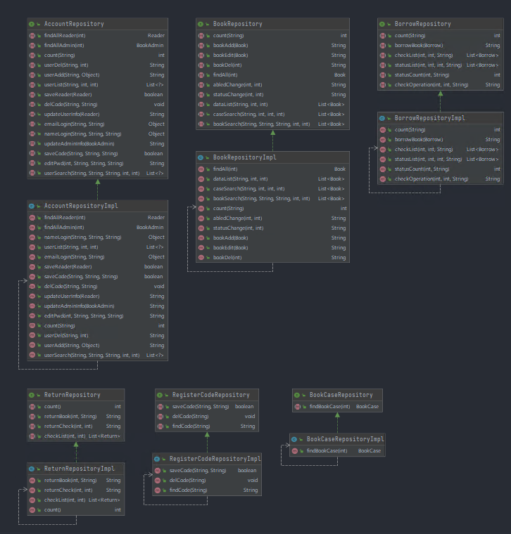
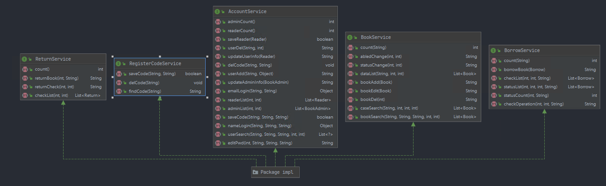
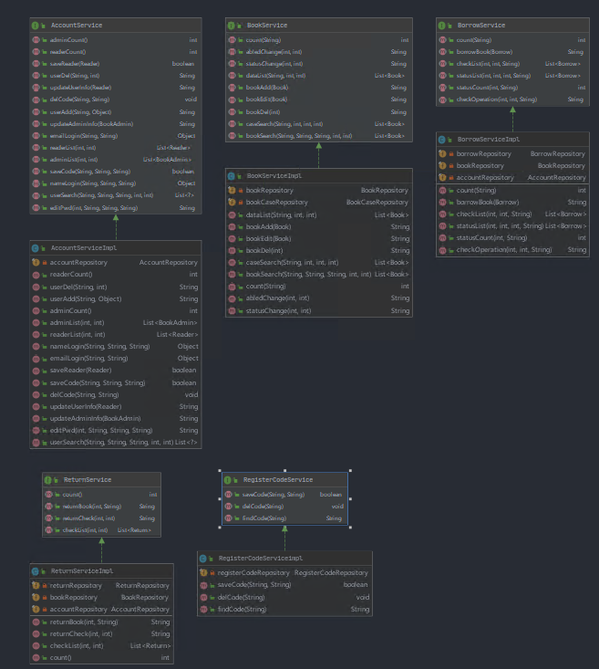
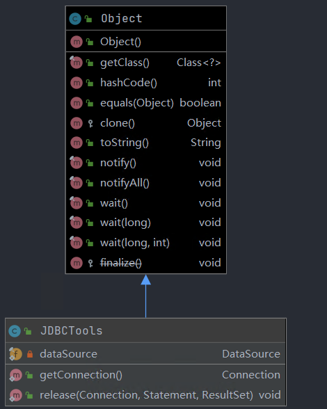

# 系统设计
### 1 系统功能设计说明
（1）登录:管理员和读者可以通过输入用户名和密码或者邮箱验证码登录；

（2）注册:普通用户可以通过邮箱的方式注册用户账号

（3）用户管理:超级管理员可以对用户进行增删改查的操作；

（4）图书管理:管理员登录后可以对书库中的书进行增删改查；

（5）借书管理：读者可以借书与还书；

（6）图书借/还书审核:管理员对读者借书和还书进行审核；

（7）图书检索：读者和管理员可以搜索书库中的书，例如，按图书编号、书名、作者、图书类型任选一种方式进行搜索；

### 2 Diagrams流程图
+ ####  controller目录下类的继承关系图

+ #### entity目录下实体类的继承关系图

+ #### filter目录下类的继承关系图

+ #### mail目录下类的继承关系图

+ #### repository目录下的接口及对应的接口实现类
>  ##### **自定义接口**

>  ##### **接口实现类**

+ #### service目录下的接口及对应的接口实现类
> ##### **自定义接口**

> ##### **接口实现类**

+ #### utils目录下类的继承关系图
